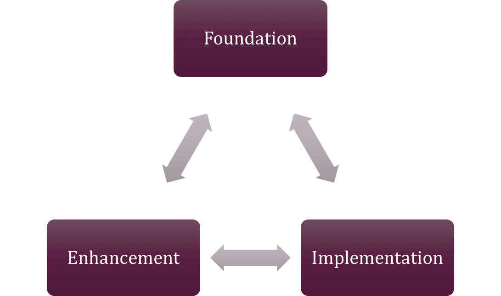

# Implementation Strategy
The implementation strategy is a three-pronged approach that includes foundational, implementation and added capabilities.  While each of these can be implemented separately, it is the goal to use an Agile approach and implement them in unison thus delivering functionality quickly and in tandem.

While this is a newer concept to Columbia, it has worked effectively in many organizations and will speed up our work. Though it requires more focus and staffing up front, as the teams start delivering functionality the organization will embrace the work and the teams will start to move faster and deliver better functionality.

Within each prong of the support there may be many teams. For instance, we are building the Open Data Platform, a foundation for all integrations and solutions while at the same time delivering data and analytics as part of a McKinzie project. Another example is with the functional teams. There are 5 teams that deliver work but they all work toward the common goal of making Dynamics 365 functional and modernizing the Columbia greater omni-commerce environment.

## Foundation
The foundation of the Global Retail Platform starts with the **Open Data Platform (ODP)** and Microsoft Azure. The ODP provides access to cloud services, compute, data management and API functionality through the **Digital Hybrid and Cognitive Integration Architecture (DHCI)**. The ODP will be delivered in phases. 

The following phases are in order of importance. As the team decomposes these capabilities, they will decompose them into user stories and tasks and then facilitate the actual implementation of key resources.

Each group and phase has links to the Specflow Feature Files used to implement the functionality. Each Feature File has automated testing associated with it.

----

