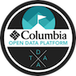

Welcome to Columbia's Open Data Platform documentation!
===============================

Contents:

* :ref:`onboarding`
* :ref:`demos`
* :ref:`implementation`

.. _onboarding:

.. toctree::
   :maxdepth: 1
   :caption: Welcome to the ODP team

   Introduction
   Principles/cloud-principles
   Principles/pipeline

.. _demos:

.. toctree::
   :maxdepth: 1
   :caption: Open Data Platform Demos

   Demos/demo-principles
   Demos/demo-2017-08-18
   Demos/demo-2017-09-01

.. _implementation:

.. toctree::
   :maxdepth: 1
   :caption: Implementation Strategy

   Implementation/implementation-strategy
   Implementation/odp-frameworks
   Implementation/dynamics-365-and-automation
   Implementation/3rd-party-boundary-integrations
   Implementation/functional-apis
   Implementation/hr-systems
   Implementation/creative-solutions
   Implementation/on-premises-integrations
   Implementation/payment-solutions
   Implementation/store-solutions

.. image:: assets/images/digitalservicefabric-96.png
