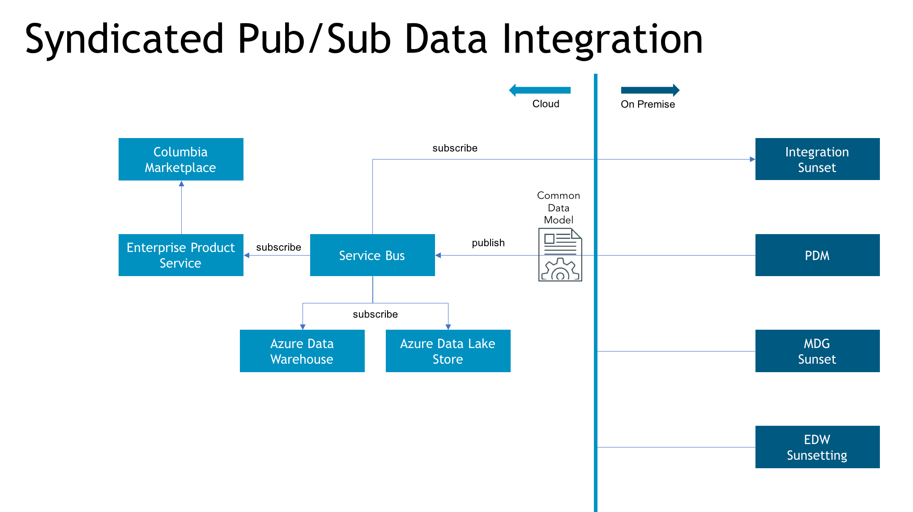

# Enterprise Product Service v1
The Enterprise Product Service is designed to be the one-stop-shop for product data. It was dynamically generated from Swagger and deployed to a web app service in Azure PaaS.

## Product Data
Product data is the base data that is on all products. This is a limited set of data elements but is common to all products. As products change, product variants are created.

### Example fields being returned:
* Brand
* Care
* Category

## Product Variants
Product variants are used to describe unique features of a product. This means that sizes, colors, etc. are included and defined.

## How does it work?

## Specflow Feature Files
[API Functional Product Service](http://pickledocs.azurewebsites.net/Index.html?feature=API\EnterpriseProductService\API_Functional_ProductService.feature)

[API REST Product Service](http://pickledocs.azurewebsites.net/Index.html?feature=API\EnterpriseProductService\API_REST_ProductService.feature)

[API REST Product Variants](http://pickledocs.azurewebsites.net/Index.html?feature=API\EnterpriseProductService\API_REST_ProductVariants.feature)

[API REST Product Regions](http://pickledocs.azurewebsites.net/Index.html?feature=API\EnterpriseProductService\API_REST_StandardRegions.feature)

[API REST Product Seasons](http://pickledocs.azurewebsites.net/Index.html?feature=API\EnterpriseProductService\API_REST_StandardSeasons.feature)

----

© 2017 Columbia Sportswear | All Rights Reserved